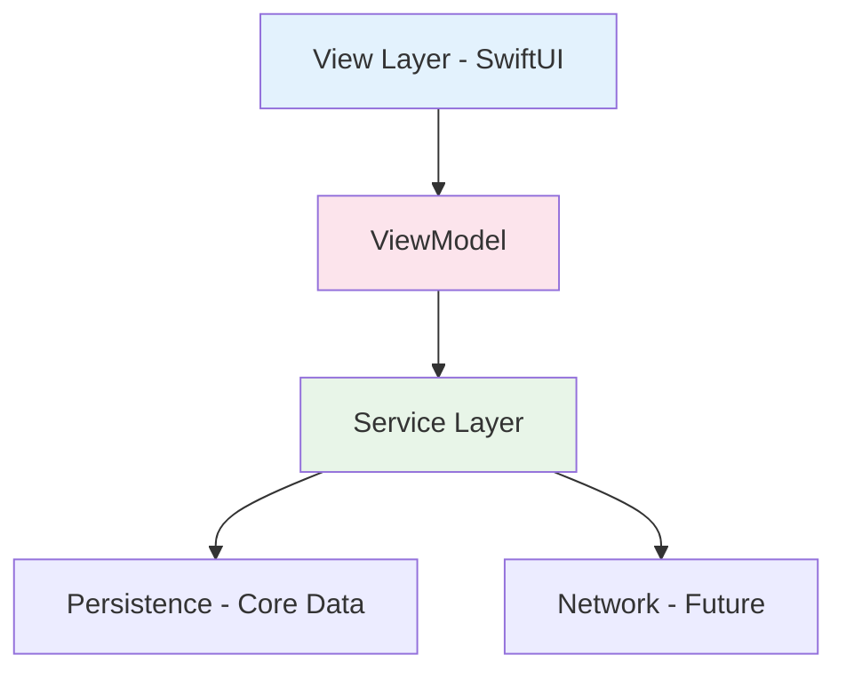

#  PageBook iOS

**Элегантное нативное iOS-приложение** с акцентом на безупречный UX и плавность анимаций! 🚀

[](https://swift.org)
[](https://developer.apple.com/xcode/swiftui/)
[](https://developer.apple.com/ios/)
[](LICENSE)

## 🌟 О проекте

PageBook - это нативное iOS-приложение для работы со справочными материалами, заметками, задачами и календарем. Часть кроссплатформенного проекта PageBook, разрабатываемого нативно для обеих платформ.

> 🤖 **Android версия**: [PageBook Android](https://github.com/MaxGog/PageBook-android)

## ✨ Основные возможности

### 📝 Интеллектуальные заметки
- Создание и редактирование с поддержкой форматирования 🎨
- Организация по папкам и тегам 🏷️
- Мгновенный поиск с подсветкой

### ✅ Менеджер задач
- Умные списки дел с приоритетами
- Напоминания и уведомления
- Отслеживание прогресса

### 🗓️ Календарь и планирование
- Ежедневное, недельное и месячное виды
- Интеграция с задачами и событиями
- Плавные переходы и жесты

## 🛠 Технологический стек

- **💙 Swift 5.9** - современный и безопасный код
- **🎨 SwiftUI** - декларативный UI фреймворк
- **⚡ Combine** - реактивное программирование
- **💾 Core Data** - мощное локальное хранилище
- **🔄 Swift Concurrency** - async/await
- **📐 SwiftUI Animations** - плавные анимации

## 🏗 Архитектура



### Чистая архитектура с MVVM
- **View Layer**: SwiftUI Views + Modifiers
- **ViewModel Layer**: ObservableObject + @Published
- **Service Layer**: Data management & business logic
- **Persistence Layer**: Core Data with SwiftUI integration

## 🚀 Быстрый старт

### Предварительные требования
- Xcode 15.0 или новее
- iOS 16.0+ SDK
- Swift 5.9+

### Установка и запуск

1. **Клонируйте репозиторий**
   ```bash
   git clone https://github.com/MaxGog/PageBook-ios.git
   cd PageBook-ios
   ```

2. **Откройте в Xcode**
   ```bash
   open PageBook.xcodeproj
   ```
   или
   - Запустите Xcode
   - File → Open → Выберите `PageBook.xcodeproj`

3. **Настройте проект**
   - Выберите целевое устройство или симулятор
   - Убедитесь, что выбрана схема "PageBook"

4. **Запустите приложение**
   - Нажмите ▶️ Run или `Cmd + R`
   - Дождитесь сборки и запуска

## 📁 Структура проекта

```
PageBook-iOS/
├── Sources/
│   ├── Models/              # Data models
│   │   ├── Note.swift       # Модель заметки
│   │   ├── Task.swift       # Модель задачи
│   │   └── CalendarEvent.swift # Модель события
│   ├── Views/               # SwiftUI Views
│   │   ├── Screens/         # Экраны приложения
│   │   │   ├── Notes/       # 📝 Работа с заметками
│   │   │   ├── Tasks/       # ✅ Управление задачами
│   │   │   └── Calendar/    # 🗓️ Календарь и планирование
│   │   ├── Components/      # Переиспользуемые компоненты
│   │   └── Modifiers/       # Кастомные модификаторы
│   ├── ViewModels/          # Бизнес-логика
│   │   ├── NotesViewModel.swift
│   │   ├── TasksViewModel.swift
│   │   └── CalendarViewModel.swift
│   ├── Services/            # Служебные сервисы
│   │   ├── PersistenceService.swift  # Core Data
│   │   ├── NotificationService.swift # Уведомления
│   │   └── DataSyncService.swift     # Синхронизация
│   └── Utilities/           # Утилиты и extensions
│       ├── Extensions/      # Swift extensions
│       ├── Constants/       # Константы приложения
│       └── Helpers/         # Вспомогательные функции
├── Resources/               # Ресурсы
│   ├── Assets.xcassets      # Изображения и иконки
│   ├── LaunchScreen.storyboard # Launch Screen
│   └── Info.plist           # Конфигурация приложения
└── PageBook.xcodeproj       # Проект Xcode
```

## 🧩 Основные модули

| Модуль | Описание | Технологии |
|--------|----------|------------|
| **Notes** | Управление заметками 📝 | SwiftUI, Core Data, @FetchRequest |
| **Tasks** | To-do листы и задачи ✅ | SwiftUI, Combine, UserNotifications |
| **Calendar** | Планирование и события 🗓️ | SwiftUI, DatePicker, Calendar |

## 🛠 Разработка

### Сборка проекта
```bash
xcodebuild -project PageBook.xcodeproj -scheme PageBook -configuration Debug
```

### Тестирование
```bash
xcodebuild test -project PageBook.xcodeproj -scheme PageBook -destination 'platform=iOS Simulator,name=iPhone 15'
```

### Анализ кода
- Включите SwiftLint в build phases
- Используйте Analyze в Xcode (Cmd+Shift+B)

## 🤝 Участие в разработке

Мы рады контрибьюторам! Вот как вы можете помочь:

### 🐛 Сообщение о багах
- Используйте [Issues](https://github.com/MaxGog/PageBook-ios/issues)
- Опишите шаги для воспроизведения
- Укажите версию iOS и устройство

### 💡 Предложение улучшений
- Откройте Issue с меткой `enhancement`
- Опишите проблему и предлагаемое решение

### 🔧 Pull Requests
1. Форкните репозиторий
2. Создайте feature branch (`git checkout -b feature/amazing-feature`)
3. Сделайте коммит изменений (`git commit -m 'Add amazing feature'`)
4. Запушьте branch (`git push origin feature/amazing-feature`)
5. Откройте Pull Request

### 🏷️ Good First Issues
Начните с задач, помеченных `good first issue` - они идеальны для новичков!

## 🎯 Планы развития

- [ ] **Синхронизация с iCloud** ☁️
- [ ] **Виджеты для домашнего экрана** 📱
- [ ] **Поддержка iPad и Mac** 💻
- [ ] **Интеграция с Shortcuts** ⚡
- [ ] **Темная тема с адаптивными цветами** 🌙

## 📄 Лицензия

Этот проект распространяется под лицензией MIT. Подробнее см. в файле [LICENSE](LICENSE).

## 👨‍💻 Автор

**MaxGog**
- GitHub: [@MaxGog](https://github.com/MaxGog)

## 💬 Обратная связь

Есть вопросы или предложения? Не стесняйтесь:
- Создать [Issue](https://github.com/MaxGog/PageBook-ios/issues)
- Написать в Discussions

---

**⭐ Не забудьте поставить звезду репозиторию, если проект вам понравился!**
